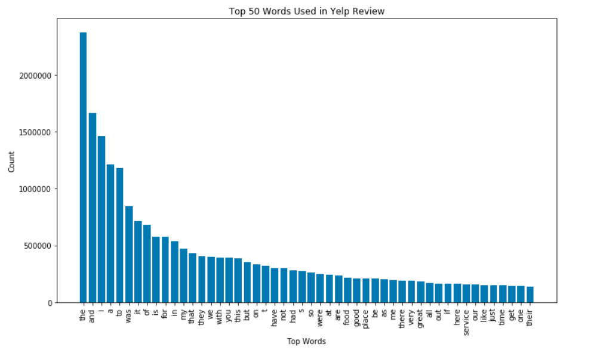
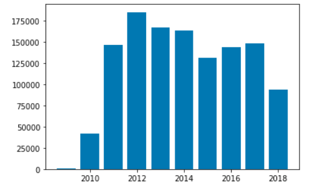

Business Help from Yelp
===
An exploratory data analysis with a deep dive into review metrics
---

**Executive Summary:**
---
Key Takeaways:
1. Top five words in business names are: the, and, restaurant, of, and pizza
2. There is a positive correlation between reviews and stars, more stars generates more reviews
3. Half of the businesses have fewer than nine reviews
4. Most reviews are positive, 3 or above

**Dataset:**
---
The Yelp Open Dataset is found at the URL yelp.com/dataset. This subset of Yelp's total dataset consists of 6.7 million reviews, 193 thousand businesses 200 thousand pictures and 10 major metropolitan areas and is a training data set for aspiring developers. The documentation for the dataset can be found [here](https://www.yelp.com/dataset/documentation/main).

The Yelp Dataset was also a year long (2019) contest ended on the 31st of December 2019 for those who can find features of interest. Contest information can be found [here](https://www.yelp.com/dataset/challenge). The dataset used in this project is from Round 12. Current Round (as of 1/10/2020) is Round 13.

| File Name | Number of Entries | Attributes |
| --------------- | ---------------| ------------------------------------------------------------|
| business.json | 192609 | names, stars, reviews_count, city, state, attributes, categories |
| checkin.json | 161950 | business_id, dates |
| photo.json | 200000 | caption, label |
| review.json | 5376719 | review_id, user_id, business_id, stars, useful, funny, cool, text, date |
| tip.json | 1223094 | text, date, compliment_count |

**Hypothesis Testing of Reviews Attributes:**
---
Using the Chi-Square Test, is a relationship between two categorical variables with an alpha of 5%?

| Categorical Variables | Chi^2 Statistic | Critical Value | p-value | Result |
| --------------- | ---------------| ---------------| ---------------| ---------------|
| Stars vs Useful | 123106.3168 | 1232.0735 | 0.000 | Reject H0, Relationship Exists |
| Stars vs Funny | 104293.2834 | 1232.0735 | 0.000 | Reject H0, Relationship Exists |
| Stars vs Cool | 104649.9059 | 1232.0735 | 0.000 | Reject H0, Relationship Exists |
| Stars vs Word Count | 335307.5698 | 1232.0735 | 0.000 | Reject H0, Relationship Exists |
| Useful vs Funny | 242566186.8255 | 1232.0735 | 0.000 | Reject H0, Relationship Exists |
| Useful vs Cool | 276959041.9058 | 1232.0735 | 0.000 | Reject H0, Relationship Exists |
| ... | ... | ... | ... | ... |
| Stars vs Month | 314.5108 | 1232.0735 | 1.000 | Cannot Reject H0, Relationship Does Not Exist |
| Stars vs Minute | 238.3721 | 1232.0735 | 1.000 | Cannot Reject H0, Relationship Does Not Exist |

Are there any correlation between stars, useful, funny, cool, and word_count?

Correlation Table of Attributes

There seems to be some heat among useful, funny, and cool. A plot with with trend lines shows some sub-correlations?

Plot of Useful, Funny, and Cool with Trend Lines

**Hypothesis Testing of User Attributes:**
---
Are there any correlation between the attritubes in users?

**Business EDA Plots:**
---
Frequency of Reviews

Top 20 Words/Symbols in Business Names

From Top Left: Count Stars, Count Number of Reviews, Reviews vs. Stars, Review vs. Stars with Trend Line

Reviews vs. Stars

Top 15 States

Top 20 Words in Categories

Top 15 Cuisines

**Checkin EDA Plots:**
---
Checkin's by Year

Checkin's by Month

Checkin's by Day

Checkin's by Hour

Checkin's by Minute

Checkin's by Weekday

**Photos EDA Plots:**
---
Most Frequent Photo Labels

Most Frequent Photo Words

Most Frequent Photo Words

**Review EDA Plot:**
---
Most Frequent Review Words

**Tips EDA Plots:**
---
Tip Counts by Year

Compliment Counts by Year

Tip Counts by Years on Yelp

Tip Counts by Month 2009

Tip Counts by Month and Years

Tip Counts by Hour and Years

Top 20 Words in Tips

**Users EDA Plots:**
---
Users Joined By Year

Top 20 Names in Users

Reviews, Useful, Funny, Cool, Fans, Years on Yelp vs. Stars

